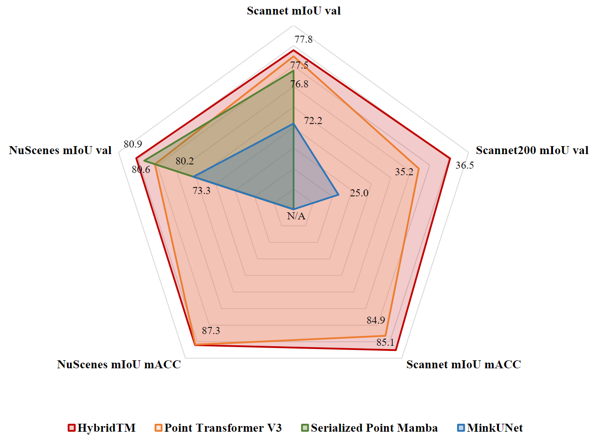
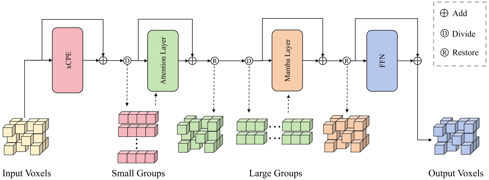

<div align="center">

### [HybridTM: Combining Transformer and Mamba for 3D Semantic Segmentation](https://arxiv.org/abs/2507.18575)

[Xinyu Wang](https://github.com/deepinact) </sup>  \*,
[Jinghua Hou](https://github.com/AlmoonYsl) </sup>  \*,
[Zhe Liu](https://happinesslz.github.io)  </sup>,
[Yingying Zhu](https://xbai.vlrlab.net) ✉</sup>
<br>
<sup></sup> Huazhong University of Science and Technology
<br>
  \* Equal contribution, ✉ Corresponding author
<br>



</div>

## Abstract 

Transformer-based methods have demonstrated remarkable capabilities in 3D semantic segmentation through their powerful attention mechanisms, but the quadratic complexity limits their modeling of long-range dependencies in large-scale point clouds. While recent Mamba-based approaches offer efficient processing with linear complexity, they struggle with feature representation when extracting 3D features. However, effectively combining these complementary strengths remains an open challenge in this field. In this paper, we propose HybridTM, the first hybrid architecture that integrates Transformer and Mamba for 3D semantic segmentation. In addition, we propose the Inner Layer Hybrid Strategy, which combines attention and Mamba at a finer granularity, enabling simultaneous capture of long-range dependencies and fine-grained local features. Extensive experiments demonstrate the effectiveness and generalization of our HybridTM on diverse indoor and outdoor datasets. Furthermore, our HybridTM achieves state-of-the-art performance on ScanNet, ScanNet200, and nuScenes benchmarks.

<div align="center">



</div>

## News
* **2024.06.30**: HybridTM has been accepted by IROS 2025 as Oral presentation. 

## Results
* **Scannet Val**

| Method | Present at | mIoU |
|:-------|:----------:|:----:|
| MinkUNet | CVPR 2019 | 72.2 |
| O-CNN | SIGGRAPH 2017 | 74.0 |
| ST | CVPR 2022 | 74.3 |
| Point Transformer v2 | NeurIPS 2022 | 75.4 |
| OctFormer | SIGGRAPH 2023 | 74.5 |
| Swin3D | arXiv 2023 | 75.5 |
| Point Transformer v3 | CVPR 2024 | 77.5 |
| Point Mamba | arXiv 2024 | 75.7 |
| Serialized Point Mamba | arXiv 2024 | 76.8 |
| Ours | - | 77.8 |

* **Scannet200 Val**

| Model                | Presented at  | mIoU |
| :------------------- | :-----------: | :--: |
| MinkUNet             | CVPR 2019     | 25.0 |
| OctFormer            | SIGGRAPH 2023 | 32.6 |
| Point Transformer V2 | NeurIPS 2022  | 30.2 |
| Point Transformer V2 | CVPR 2024     | 35.2 |
| Ours                 | -             | 36.5 |

* **S3DIS Area5**

| Model | Present at | Aera5 (mIoU) |
|:-----|:----------:|:--:|
| MinkUNet | CVPR 2019 | 65.4 |
| PointNeXt | NeurIPS 2022 | 70.5 |
| Swin3D | arXiv 2023 | 72.5 |
| Point Transformer v2 | NeurIPS 2022 | 71.6 |
| Serialized Point Mamba | arXiv 2024 | 70.6 |
| Ours | - | 72.1 |

* **nuScenes Val**

| Model | Present at | mIoU |
|:------|:----------:|:--:|
| MinkUNet | CVPR 2019 | 73.3 |
| SPVNAS | ECCV 2020 | 77.4 |
| Cylender3D  | CVPR 2021 | 76.1 |
| AF2S3Net | CVPR 2021 | 62.2 |
| SphereFormer | CVPR 2023 | 79.5 |
| Point Transformer v3 | CVPR 2024 | 80.2 |
| Ours | - | 80.9 |

## Installation
Please refer to [INSTALL.md](docs/INSTALL.md) for the installation of HybridTM codebase.


## Getting Started
```
# ScanNet
sh scripts/train.sh -g 4 -d scannet -c semseg-hybridTM-v1m1-0-base -n semseg-hybridTM-v1m1-0-base

# ScanNet200
sh scripts/train.sh -g 4 -d scannet200 -c semseg-hybridTM-v1m1-0-base -n semseg-hybridTM-v1m1-0-base

# S3DIS
sh scripts/train.sh -g 4 -d s3dis -c semseg-pt-v3m1-0-rpe -n semseg-pt-v3m1-0-rpe

# Scratched nuScenes
sh scripts/train.sh -g 4 -d nuscenes -c semseg-hybridTM-v1m1-0-base -n semseg-hybridTM-v1m1-0-base
```

## TODO

- [x] Release the paper.
- [ ] Release the checkpoints of HybridTM on the Scannet.

## Citation
```
@inproceedings{hybridTM,
  title={HybridTM: Combining Transformer and Mamba for 3D
Semantic Segmentation},
  author={Wang, Xinyu and Hou, Jinghua and Liu, Zhe and Zhu, Yingying},
  booktitle={IEEE/RSJ International Conference on Intelligent Robots and Systems},
  year={2025}
  }
```

## Acknowledgements
We thank these great works and open-source repositories:
[Pointcept](https://github.com/Pointcept/Pointcept), [LION](https://github.com/happinesslz/LION), [Mamba](https://github.com/state-spaces/mamba), [Spconv](https://github.com/traveller59/spconv) and [flash-linear-attention](https://github.com/sustcsonglin/flash-linear-attention).
